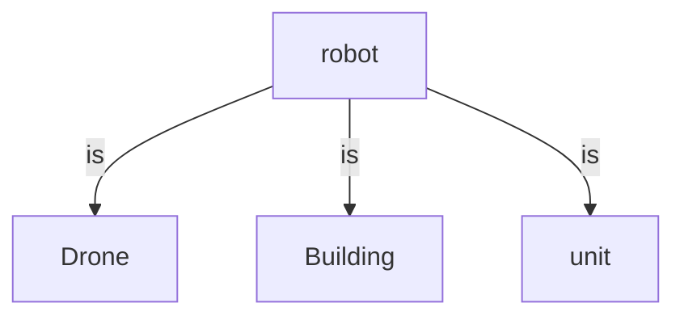
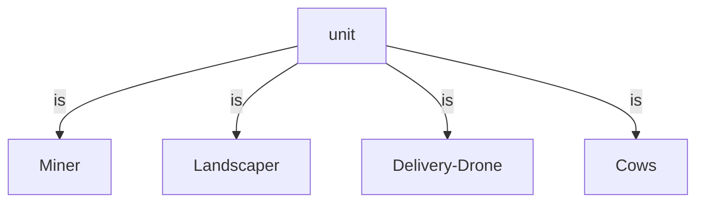
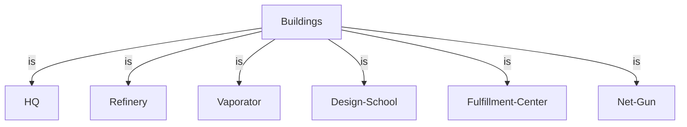
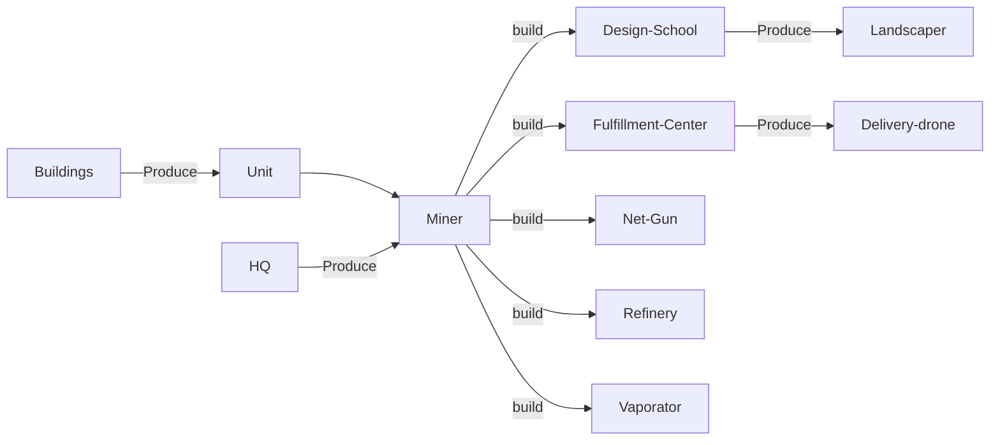

# CS-454-554-Project
Battlecode Fall-2020 Group Project

Trello Board: https://trello.com/b/KhSSlwmB/battlecode

# Team member
  -  Hashimoto, Tyde K.
  -  Van Eeden, Simon J.
  -  He, Shengjia
  -  Su, Robin

# Relationship Graph
If use the Chrome, then need to add this extension: GitHub+Mermaid

# Solution overview
We list what solution we have done in this term.

    - Blockchain
        - Get the HQ location
        - emit enemy HQ 

    - Drone
        - Drone can pick up our landscapers to the enemy's area and drop them.
        - Drone can pick up cows and drop to water.
        - Drone can pick up enemy's landscapers and drop to water.
        - Drone can hover
    
    - FulfillmentCenter
        - Build up drone
    
    - HQ
        - Build up Fulfillment Center
        - Build up Net Gun
        - Build up Vaporator
        - Build Miner robot
    
    - Landscaper
        - Build the wall to protect unit
        - Our landscapers can remove one unit of dirt from an adjacent in the enemy's HQ area
        - If our HQ is buried, then landscaper can dig it out
        - Bury the enemyHQ as frequently as possible
    
    - Miner
        - Wander around in a general straight line until nearby soup is found
        - Move to the soup
        - Mine nearby soup
        - Take the soup to refine
        - Build up Design School
    
    - NetGun
        - Shots the Drone
    
    

# The Game Specifications
https://sebattlecode.com/specs.html

    
